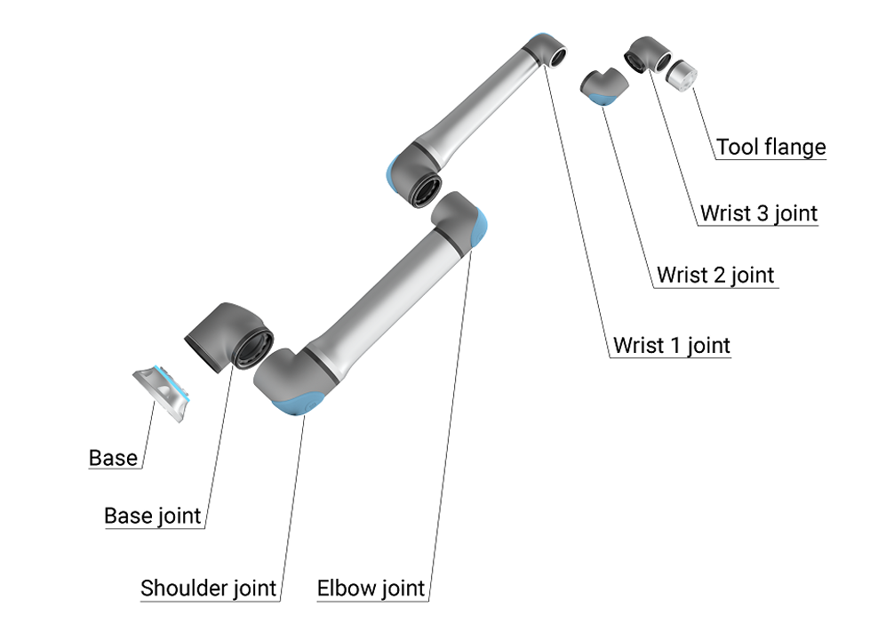
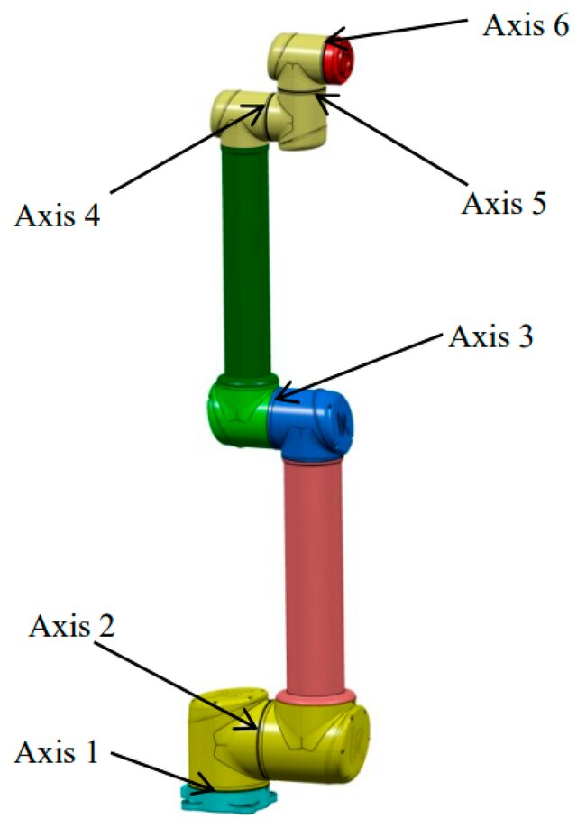
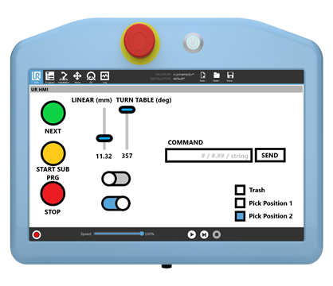

# 🤖 TH OWL Robot Lab: Beginner's Kit

Welcome to the **Robo Lab Projects** repository! This is a centralized hub for students and researchers working with robotics, computer vision, and AI at TH OWL. 

Whether you are here for a workshop, a semester project, or independent research, this kit provides everything you need to get the robot moving safely and effectively.

---

## 📡 Lab Essentials

Before you start, ensure you are connected to the internal lab network.

| Resource | Detail |
| :--- | :--- |
| **Wi-Fi SSID** | `robot-wifi` |
| **Wi-Fi Password** | See label on the physical router in the lab |
| **Robot Model** | Universal Robots UR10e (Cobot) |
| **Default Robot IP** | `192.168.x.x` (Check the Teach Pendant) |

> **Note:** For security, specific login credentials for the Lab PCs and Tapo cameras are not stored in this repository. Please consult the lab supervisor or check the physical `Documentation` folder in the lab.

---

## 🛡️ Safety First (The Golden Rules)

The UR10e is a "Collaborative Robot" (Cobot), but it is still a powerful machine. **Safety is your priority.**

1.  **Emergency Stop:** Locate the red E-Stop button on the Teach Pendant before every run.
2.  **Remote Control Mode:** To control the robot via Python, the Teach Pendant must be set to **Remote Control** mode.
3.  **Clear Workspace:** Ensure no people or expensive equipment are within the "Reach Zone" (~1.3m) of the robot.
4.  **Low Speed First:** Always test new code with the speed slider set to **10% or lower** on the Teach Pendant.

---

## 🦾 About the UR10e Robot

The UR10e is a **Collaborative Robot (Cobot)** designed to work alongside humans. It features a 10kg payload and a 1300mm reach, making it ideal for a wide range of tasks from precision assembly to heavy lifting.

### Hardware Components
The complete robot system consists of three primary components:



*   **Robot Arm:** The 6-axis manipulator made of aluminum and articulated joints.
*   **Control Box:** The "brain" of the system, housing the computer and power supplies.
*   **Teach Pendant:** The 12-inch touchscreen interface used to program and move the robot.

### Joint Nomenclature
The robot has 6 rotating joints. Knowing their names is essential for programming and safety:



1.  **Base:** The foundation of the robot.
2.  **Shoulder:** The first large vertical joint.
3.  **Elbow:** The second large vertical joint.
4.  **Wrist 1:** Handles vertical orientation of the tool.
5.  **Wrist 2:** Handles horizontal orientation of the tool.
6.  **Wrist 3:** The rotating flange where tools (End Effectors) are attached.

### The Teach Pendant
The primary interface for manual control and programming:



### The Tool Flange (End Effector)
The end of the robot (Wrist 3) is where you mount your tools (grippers, cameras, etc.).
*   **Built-in I/O:** The tool flange has its own electrical connector (M8 8-pin) for digital and analog signals.
*   **Power:** It provides a 12V/24V power supply (up to 2A) so you don't need messy cables running down the arm.

---

## 📂 Project Roadmap

This repository is organized into modular projects. Start with the **Python Template** if you are a beginner.

> 🌐 The full catalogue — with safety rules, a robot-use request form and
> per-project ZIP downloads — lives on the lab website:
> **https://ineedabetterusrname.github.io/THOWL_RoboLab/**

### 🐣 [A. Python Template](./UR10e_Documentation/Python_Template/)
The absolute basics. A single script to connect to the robot and perform a simple move. Use this to verify your connection.
*   **Key Tool:** `ur_rtde` library.

### 🖐️ [B. Interactive Robot](./Projects/Interactive_robot/)
The "Gesture Teleoperation" system. Control the UR10e in real-time using your hands via a webcam.
*   **Key Tools:** Mediapipe (Hand Tracking), PyBullet (Physics Simulation).

### 👁️ [C. Tapo Vision Kit](./Projects/Tapo_camera/)
Advanced vision tools for the TP-Link Tapo C110. Includes AprilTag calibration for high-accuracy robotic vision.
*   **Key Tools:** OpenCV, AprilTag.

### 🧠 [D. AI Camera Integration](./Projects/Raspberrypi+AI_camera/)
A "Cloud-Brain, Edge-Body" project using Raspberry Pi Zero 2 W and the AI Camera (IMX500) to create a self-learning robot powered by the Gemini API.

### 🪝 [E. Hanger](./Projects/Hanger/)
Rhino + Grasshopper definition for the suspended-element workflow in room 4.303.
*   **Key Tools:** Rhino, Grasshopper.

### 🧱 [F. Robotic Bricklaying](./Projects/Robotic_Bricklaying/)
Computed masonry: the UR10e lays a small running-bond wall generated entirely from parameters.
*   **Key Tools:** `ur_rtde`, web simulator.

### 🏺 [G. Contour Crafting](./Projects/Contour_Crafting/)
Construction-scale 3D printing in miniature — a tapering, twisting superellipse traced layer by layer.
*   **Key Tools:** `ur_rtde`, web simulator.

### 🏢 [H. Façade Scanning](./Projects/Facade_Scanning/)
Robotic building inspection: a serpentine raster sweep with a capture pause at every grid point.
*   **Key Tools:** `ur_rtde`, web simulator.

### 📷 [I. Tapo Camera Access](./Projects/Tapo_Camera_Access/)
Read the lab's Tapo cameras over RTSP from Python — reader thread, auto-reconnect, HTTP relay for groups.
*   **Key Tools:** OpenCV, RTSP. Credentials come from the CAAD lab administrator, never this repo.

### 🏗️ [J. Robo Lab 3D Model](./Projects/Robo_lab_Model/)
The digital twin of the robot cell and Room 4 — use it for collision checks and planning before fabricating.
*   **Key Tools:** Rhino, Grasshopper.

---

## 🛠️ Setting Up Your Environment

To run the python projects in this lab, we recommend using **Python 3.10+**.

1.  **Clone the Repo**:
    ```bash
    git clone https://github.com/ineedabetterusrname/THOWL_RoboLab.git
    cd THOWL_RoboLab
    ```
2.  **Install Base Requirements**:
    Each project has its own `requirements.txt` or README. However, for most robot tasks, you will need:
    ```bash
    pip install ur_rtde opencv-python numpy
    ```

---

## 🎓 For Students: How to Contribute

We encourage students to document their work here!
1.  **Modular Folders**: Create a new folder under `Projects/` for your task.
2.  **Documentation**: Every project **must** include a `README.md` explaining how to run it.
3.  **No Secrets**: Never commit passwords or specific IP addresses to GitHub. Use placeholders (e.g., `YOUR_IP`).

---

**Happy Coding!** 🤖🚀
*TH OWL - Architecture & Robotics*
